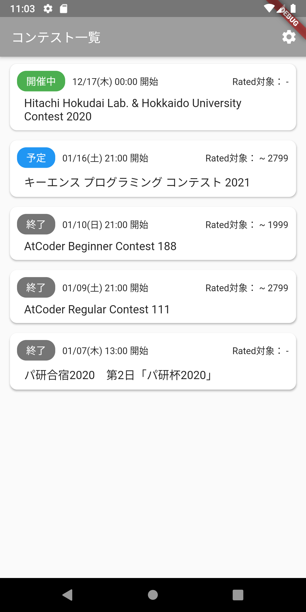
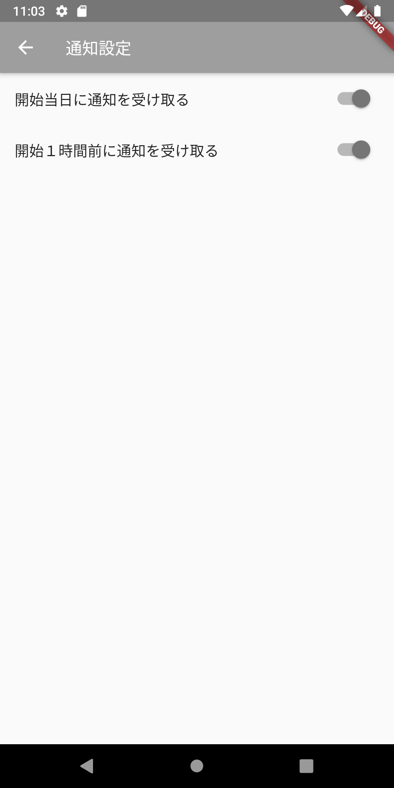
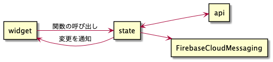

# あっとアラーム

このアプリは、[AtCoder](https://atcoder.jp/)のコンテスト情報の一覧を閲覧、コンテスト開始前に通知を受け取ることができるアプリです。

## 主な機能
### コンテスト一覧画面

コンテスト情報を閲覧できます。

### 通知画面

アプリから以下の通知を受け取るかを設定することができます。
- コンテスト開始当日の朝９時
- コンテスト開始１時間前

## アーキテクチャ

アプリの状態を保持する`state`は、ChangeNotifierを継承し、状態の変更があれば、
`notifyListeners`関数を呼びだし、`widget`に変更を通知
